# Routstr User Flow

How a user goes from zero to a working AI gateway, and what happens behind the scenes at every step.

## The setup wizard (5 steps)

### Step 1: Configure

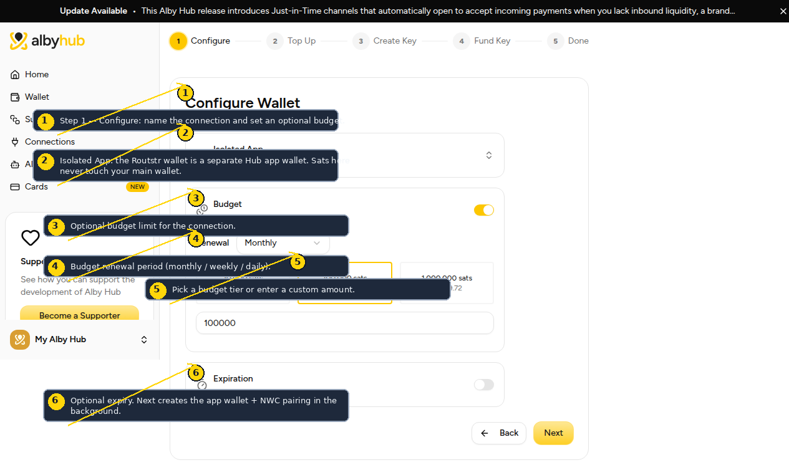

| You | Behind the scenes |
|---|---|
| Name the connection, pick a budget and renewal, optionally an expiry | The Hub creates an **isolated app wallet** for Routstr with NWC scopes and the budget. Sats in this wallet are separate from your main wallet. |

### Step 2: Top Up Wallet

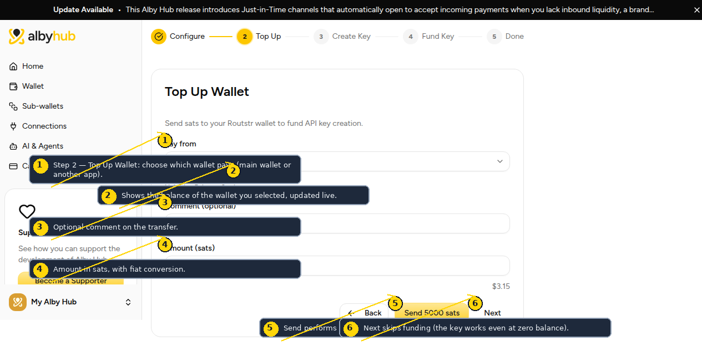

| You | Behind the scenes |
|---|---|
| Choose which wallet pays (main wallet or another app), set an amount, optionally a comment | A Hub **transfer** moves sats into the Routstr wallet: `POST /api/transfers` with `fromAppId`. Instant and free. The balance line shows the wallet you selected. |
| Next (skip) | Funding is optional now. The key works at zero balance; you can top up later. |

### Step 3: Create API Key

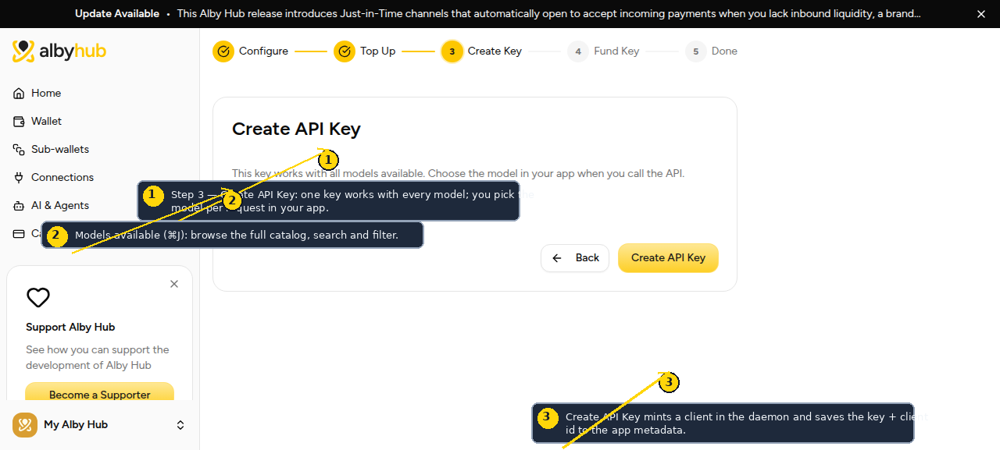

| You | Behind the scenes |
|---|---|
| Click Create API Key | The daemon mints a client: `POST /clients/add` stores the `sk-` key in its local registry (`routstr.db`). The key + client id are saved to the app metadata. This is where the full key is shown, once. |
| Models available (⌘J) | Browse the aggregated catalog: every model the provider federation offers, with pricing in sats. |

### Step 4: Fund Key

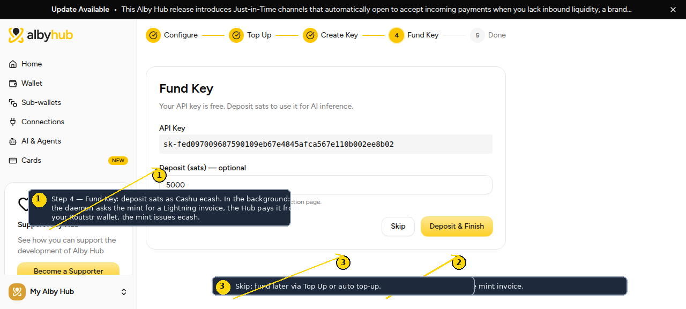

| You | Behind the scenes |
|---|---|
| Enter an amount, click Deposit & Finish | The daemon asks the Cashu mint for a Lightning invoice (`/wallet/receive/bolt11`). The Hub pays it from the Routstr wallet (`/api/payments/{invoice}` with `fromAppId`). The mint issues ecash; the daemon's Cashu balance rises. |
| Skip | Deposit later via Top Up or auto top-up. |

### Step 5: Done

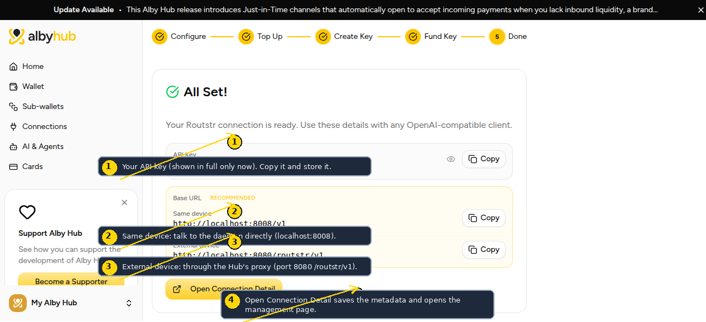

| You | Behind the scenes |
|---|---|
| Copy the API key and the base URL for your device | Opening Connection Detail saves the metadata and opens the management page. |

**Two base URLs, one key:**

- **Same device** (`http://localhost:8008/v1`): the daemon directly. Use on the machine running the Hub.
- **External device** (`http://<hub>:8080/routstr/v1`): through the Hub's reverse proxy, which forwards to the daemon. Use anywhere else, with any OpenAI-compatible client.

## The connection page

### Key section

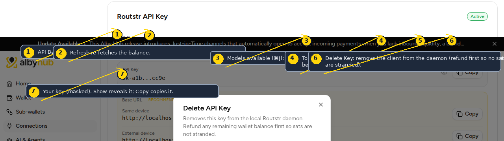

| Control | What it does | Behind the scenes |
|---|---|---|
| API Balance + refresh | Live balance | Daemon `GET /keys/balance` (wallet + provider tokens). |
| Models available (⌘J) | Browse the catalog | Aggregated model list, 30-minute cache. |
| Top Up | Add sats as ecash | Mint invoice, Hub pays from the Routstr wallet. |
| Refund | Convert ecash back to sats | Hub creates an **app-scoped invoice**; the daemon melts ecash to pay it, so sats land directly in the Routstr wallet (no main-wallet hop). |
| Delete Key | Remove the client | Daemon `POST /clients/delete` + metadata cleared. Requires zero balance. |
| Show / Copy | Reveal or copy the key | Key is stored masked in the UI. |

### Auto top-up and base URLs

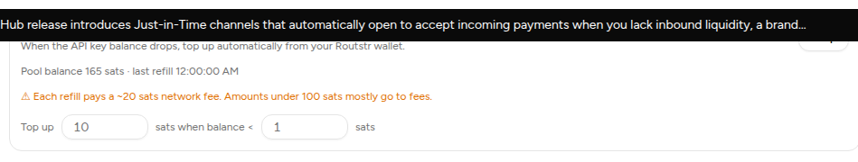

| Control | What it does | Behind the scenes |
|---|---|---|
| Start / Stop | Turn auto top-up on or off | The Hub supervision loop (15s tick) reads the `autoRefill` config from app metadata: when the balance drops below the threshold, it funds the Cashu wallet from the Routstr wallet, with a 5-minute cooldown. The buttons hit `POST /api/routstrd/autorefill/start|stop`; the status line shows the live pool balance, last refill, and errors (polled every 30s). |
| Base URLs | Same device vs external | As shown at Step 5: direct daemon (`:8008`) or Hub proxy (`:8080/routstr/v1`). |

## Dialogs

| Dialog | What it does |
|---|---|
| 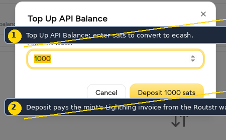 | Deposits sats as ecash (mint invoice paid from the Routstr wallet). |
| 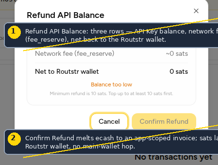 | Shows API Key balance, network fee (fee_reserve), and net back to the Routstr wallet before confirming the melt. Minimum refund 10 sats. |
| 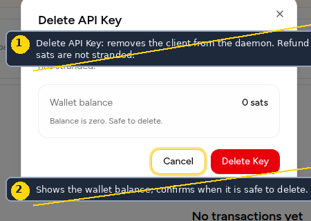 | Confirms the wallet balance is zero before removing the key from the daemon. |
| 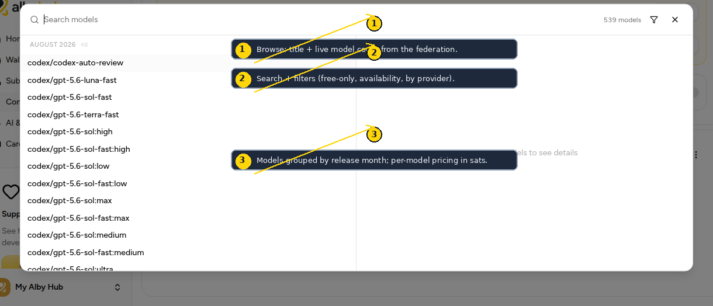 | Searchable, filterable catalog of every model in the federation, grouped by month with per-model sats pricing. |

## What happens on a request

```
Your app → base URL + key → daemon
  1. Client lookup (usage accounting)
  2. Wallet balance gate (Cashu mint balance)
  3. Pick the cheapest provider that has the model
  4. Call the provider, authenticated with a prepaid ecash token
  5. Stream the response back
```

The prepaid token is topped up from the daemon's Cashu wallet when it runs low. Provider failures fail over to the next cheapest (5-minute cooldown per provider).
